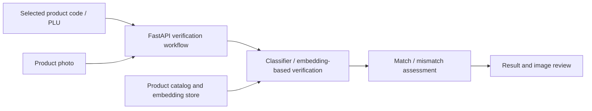

# Camera-Based Retail Product Verification

**A software engineering case study by Haluk Doğaç Ergüvenç**

A camera-assisted verification system that compares the product selected on a retail scale with an image of the item being weighed. Its purpose is to identify product-label mismatches before they lead to incorrectly priced labels.

I independently handled the project's AI development, including data workflows, model training, and inference integration. The project covered approximately **40 product classes** and reached a **store pilot**, where store managers tested it.

Implementation code and store data are not included here.

## My contributions

- Trained image classifiers with **PyTorch**, including **ResNet18**, and developed embedding-based verification workflows.
- Integrated local model inference into a **FastAPI** backend, with offline operation and support for cloud vision APIs.
- Built workflows for image collection, model training, embedding storage, batch evaluation, and live verification.
- Developed a **React / Tailwind CSS** management interface for product codes, operating modes, metrics, and image review.

**Stack:** Python · PyTorch · ResNet18 · OpenCV · FastAPI · MongoDB · React · Tailwind CSS

## Conceptual verification flow

The diagram summarizes the workflow; it does not specify a fixed combination of models or the scale's label-printing rules.

## Read the case study

[Problem, responsibilities, architecture, and pilot outcome](case-study.md)

## Contact

[LinkedIn](https://www.linkedin.com/in/haluk-dogac-erguvenc) · [GitHub](https://github.com/DogacErguvenc)
